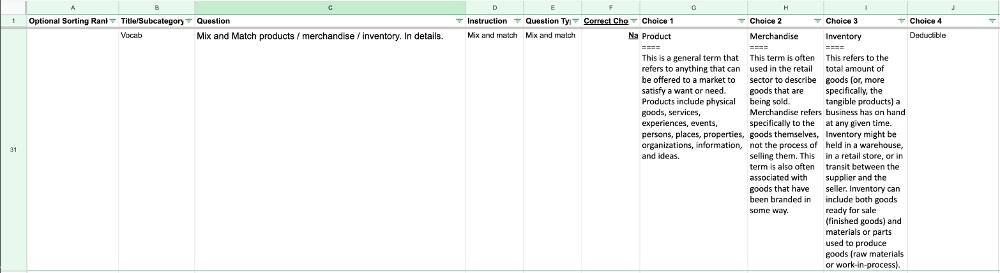

# Create Quizzes from Google Sheets


<a target="_blank" href="https://github.com/Siphon880gh" rel="nofollow"></a>
<a target="_blank" href="https://www.linkedin.com/in/weng-fung/" rel="nofollow"></a>
<a target="_blank" href="https://www.youtube.com/user/Siphon880yt/" rel="nofollow"></a>

## :page_facing_up: Description:
By Weng Fei Fung. Easily create various types of quizzes from Google Sheet. A Google spreadsheet URL and tab name with the right columns inputted and you have yourself a quiz. There are multiple choices, fill in the blanks, Select all that apply (SATA), True/False, and flash cards. You can have audio and video elements. You can have more than the four standard multiple choices (as many choices as you add columns in Google sheet). Because you can also have just two choices by just having two choice  columns in your Google Sheet, you effectively can have True/False questions as well. Optionally you can add a countdown timer. Minimal coding knowledge needed. And mostly all in Google Sheets.

## :open_file_folder: Table of Contents:
---
- [Description](#page_facing_up-description) <!-- - [Screenshots](#camera-screenshots) -->
- [Live Demo](#computer-live-demo)
- [Installation and Quiz Administration](#minidisc-installation-and-quiz-administration)
- [Usage](#runner-usage)
- [Architecture](#triangular_ruler-architecture)
- [Future Version](#crystal_ball-future-version)
---

<!-- ## :camera: Screenshots:
 -->

## :computer: Live Demo:
<a href="https://wengindustry.com/tools/quiz-gsheet" target="_blank">Check it out</a>

<!-- 
:camera: Preview:
---
 -->

## :minidisc: Installation and Quiz Administration:

Install PHP Google API Client by running `composer install google/apiclient` 

At gsheets/, create a folder that represents a group of quizzes. Even if you have one quiz, you must create a folder. The front page will show quizzes grouped by categories, and the categories are your folders, followed by quizzes that belong to those folders aka categories.

Create a PHP file inside your folder, and that will represent your connection to a specific Google Sheet tab that has your quiz details. Remember the file ends with file extension .php. Then input your Google sheet id and tab name into the PHP file like this:

```
<?php
session_start();

/* INPUTS
Will be processed into $json and $overrideStyleBlock for templates
______________________________________________________________________ */
$inputs = [
    /* Connections */
    "spreadsheetUrl"=>"https://docs.google.com/spreadsheets/d/1SHqEB2MVho0jP81cT9bDEo5VUZOzkfwNC1BZ3qB8VQE/",
    "tabName"=>"AbsolutePitch",
    "creds"=>"../../keys/quizer-temporal-fx-381723.json",

    /* Display */
    "pageTitle"=>"Quiz: Identify Absolute Pitches",
    "pageDescription"=>"Play a quick quiz game to test your ears' absolute pitch skills.",

    /* Optionals OR set as defaults 0 and "" respectively */
    "timeLeft"=>0,
    "cssOverride"=>".question {
        border: 1px solid black;
        background-color: white !important;
    }"
];

/* DEVELOPER READABILITY & MAINTAINABILITY
This is for readability & maintainability
______________________________________________________________________ */
$_SESSION["spreadsheet-link"] = $inputs["spreadsheetUrl"];

$re = '/.*\/(.+)\/$/m';
preg_match_all($re, $inputs["spreadsheetUrl"], $matches, PREG_SET_ORDER, 0);
$connectToSpreadSheetUrlId = $matches[0][1];
$connectToTab = $inputs["tabName"];

$pageTitle = $inputs["pageTitle"];
$pageDesc = $inputs["pageDescription"];

$timeLeft = $inputs["timeLeft"];
$overrideCSS = $inputs["cssOverride"];

/* ENGINE
   Do not touch
______________________________________________________________________ */

// Check is initialized and not visited directly. If visited directly with no session, then initialize
// Error? gsheets accept only flat directory listing. It would have all folders then inside folder would have the quiz php files and credential creds.json files.
require_once "../../controllers/check-initialized.php";

// Check credential file correct.
$credsGsheetJSONFile = $inputs["creds"];
file_exists($credsGsheetJSONFile) or die("Error: Failed to load credentials $credsGsheetJSONFile. Contact administrator");

// Load in Composer libraries
require_once $_SESSION["root_dir"] . '/vendor/autoload.php';

// Connect API with credentials
require_once "../../controllers/connect-gsheet.php";

// Render quiz page
require_once "../../controllers/render-quiz.php";
?>
```

Notice you are only changing the code under INPUTS. You must have the spreadsheet URL, spreadsheet ID, and the tab name you are loading the quiz from. The spreadsheet ID is from the spreadsheet link, eg. "https://docs.google.com/spreadsheets/d/__GOOGLE_SHEET_ID__/". I chose to make the ID manual rather than parse from the spreadsheet URL in case Google changes their URL scheme.

Optionally, you can enable a countdown timer if it's a timed quiz. When the time runs out, the quiz ends even if not all the questions are answered. You can also optionally add styling specific to your quiz (feel free to inspect the HTML of the quiz to figure out what classes and ID's you can use).

You cannot have folders inside folders. Here is a file tree example of folders aka categories and their respective quizzes:

```
____gsheets
| |____Medicine
| | |____Cardiovascular Pharmacology Quiz.php
| | |____Infections.php
| | |____Minimally Invasive Skills SATA.php
| | |____Respiratory Pathophysiology.php
| | |____Stroke NIHSS Signs Video Quiz.php
| |____Web Development
| | |____Javascript Flash Cards.php
| | |____MySQL True False Questions.php

```

Along with the php files, you have a credential file that end with `.json`; and that's the private key you download upon creating your service account with Google Sheet API enabled at your Developer Cloud Console. You want to move this file into keys/, then link to it at your quiz php file (For example: `"creds"=>"../../keys/my-service-account-thats-shared-with-the-google-sheet.json",`). In addition, make sure you take note of the client email address in that private key file (it's unencrypted), because you want to share the Google Sheet to that email. Because the file is unencrypted, you want to have .htaccess block access to file reading. The backend PHP will have no problem reading the file, while the public is not authorized.

The index.php will automatically list the quizzes under their respective folder names, and your quiz will open when clicked if the credential file is correct.

If you want a quiz group or folder to be hidden until you enter a password, your quiz group can be named with a minus, then password, then space, followed by your category name. The index.php front page won't list your folder until you enter the correct password. Here is an example tree folder. You can enter multiple passwords on the front page to show both these categories:

```
____gsheets
| |____-HolisticSecret Naturopath
| | |____Alternative health exercises for back pain.php
| | |____Herbs for Improved Energy Quiz.php
| |____-WengSecret Personal Quizzes
| | |____Private Stock Trading Strategies.php
| | |____Code Numbers for Interdepartmental Communication.php
| |____Web Development
| | |____Javascript Flash Cards.php
| | |____MySQL True False Questions.php
```

In the above example, the Naturopath and Personal Quizzes don't show up until you unlock them with the passwords HolisticSecret and WengSecret. Other users wouldn't know there's anything to unlock because the categories don't appear. But the important key here is you have to precede the folder name with a minus and password.

Over at the Google sheet, I shared the sheet with the email address that is in the private json key (under client_email). You can also get the client email of the service account at Google Cloud Console.

The sheet must have the first row reserved for column headings. Then the columns should follow this format of columns in this order, and you can name the columns in whichever way makes sense:
- Optional Numbering for Google sheet sorting. You can have numbers here 1,2,3,4 so you can easily sort your Google Sheet. You can hide specific questions at Google Sheet with -1. Even if it's optional and you leave it blank at the rows, this column must exist because the code expects a certain number of columns from the left. 
- Title of the question that will appear on the quiz
- Text of the question, or image url, or sound clip url, depending on the type of question. In other words, the question value
- Instruction text that appears under your question on the quiz. Eg. "Select correct choice".
- Question Type column. This is the type of the question. It can be either Picture, Flash Card Absolute Pitch, Normal, etc. The quiz will look at this column cell and render the question in a specific format (for instance, whether it's a picture type question). If you have it as normal or any type the quiz doesn't recognize, it will render the question as is.
- Correct Choice. This is the index number 1,2,3,4,etc that corresponds to the columns to the right and that is the actually correct answer. The columns to the right will be choice columns. You can have multiple correct choices with comma separated values in the choice of Select all that apply (SATA):
Eg. 2
Eg. 2,3,4
Note for SATA, you do not write "SATA" for the Question Type column because you can have picture types or video types that are SATA. For example, you see a picture of a patients signs/symptoms and you select all the possible diagnoses.
- All other columns to the right are choices. You can have four columns if you want a standard multiple choice question with a,b,c,d choices. If you have two columns, you can name them True and False to make it a True/False question. Or with a two column you can name them "Got it correct" and "Got it wrong" to keep track of your flash cards but you should also have the Type column as "Flash Card" (End of quiz will review your wrong questions)


### Question Types Support:

Follow the appropriate Google Sheet format for your Question Type.
The rows can follow different formats if you have different types of questions in the same quiz. 
Make sure the Question Type cell is correct so the app knows how to read the row as a question.

- Multiple choices
- Fill in the blank via multiple choices
- True false
- Flash cards
- SATA
- Ranking/ordering
- Mix and match
- Video
- Absolute pitch
- Relative pitch

Google Sheet screenshots or templates coming soon!

### Administering Multiple Choice Questions

Just have the choices entered. You can have more than 4 multiple choices or less. The app will figure out how many choices to render based on how many columns you fill in.

Question Type column can be blank or something generic like "Text". However, you may have multiple choice questions that are sound based or picture based which can be multiple choice but must have a specific question type like "Absolute Pitch".

### Administering Fill in the Blank Questions

Treat as a multiple choice question and your question text can be: "The ___ is the powerhouse of the cell". One of your choices will have the correct text.

### Administering True/False Question (True False)
Simply have two columns of answers only.

Correct Choice column is either 1 or 2
Choice 1: TRUE
Choice 2: FALSE

Leave other choice cells blank

Note that you're not forced to have the rest of the other questions (Google Sheet rows) to have only two choice columns filled, so you are not stuck with having to do True/False questions in a quiz. In fact, you can have as many choice columns as you want filled in any question/row.

### Administering Ranking Question

You ask the user to rank the choices in order.

Put the answers in their correct order from columns F to etc.

Correct choice column will be ignored. You can write "N/A"

Question Type: `Ranked`

### Administering Mix and Match Question
Question Text:
```
Side A
===
Side B
```
Question Type: `Mix and match`

Note that you're not forced to have the rest of the other questions (Google Sheet rows) to be Flash cards.
You can have extra choices that don't have a match as a distractor. For example:



Note that if you use AI to generate questions in CSV format so that you can copy over to Google Sheet, because newlines mean new rows, the AI will render the cell as: "Side A\n===\nSide B". Then you can copy to the Google Sheet as is without having to manually replace the '\n' with blank lines. That's fine.

### Administering Flash Card Question
Question Text:
```
Side A
====
Side B
```
Question Type: `Flash cards`

Make sure it's __4 equal signs__.
May have HTML like `

Note that you're not forced to have the rest of the other questions (Google Sheet rows) to be Flash cards.

Note that if you use AI to generate questions in CSV format so that you can copy over to Google Sheet, because newlines mean new rows, the AI will render the cell as: "Side A\n===\nSide B". Then you can copy to the Google Sheet as is without having to manually replace the '\n' with blank lines. That's fine.

## :runner: Usage:

Opening the front page will show you all categorized quizzes you can take. If there are secret quizzes, then click "Passwords" to show them.

When taking a quiz, just follow the instructions on screen. If it's a timed quiz, you have a certain amount of time to finish the quiz. If you don't make it in time, the quiz will be considered done and the final score shows. Otherwise, the quiz finishes when you answered the final question.

You can select choices by clicking them or pressing your keyboard 1,2,3,4..9 depending on the number of multiple choices. A question with greater than 9 multiple choices will only support the keys 1,2,3,4...9 and you would have to click manually for the other choices. Usually questions that are Select all that apply (SATA) have that many choices.

## :triangular_ruler: Architecture:
I used Composer to install the PHP Google API client. There was no documentation on Google's site on how to authenticate using the PHP Google API client, but I figured it out like this: The API client selected for Google Sheet API (versus other Google API's) that then connected gsheet/folder/quiz_name.php using credential file at keys/. The quiz named PHP file has the spreadsheet url and tab name necessarily to connect, and the Google Sheet has been shared to the email associated to the service account. The Google Sheet API would connect to the Google Sheet ID which the PHP code extracts from the Google Sheet URL.

The credential file was generated from the service account at the Google Cloud platform when creating a private json key and it downloaded a file. The spreadsheet URL is just for the front facing when you click "Google Sheet" at the top bar, for your admin editing convenience. You must keep link the PHP quiz file to the credential file at keys/ with the "creds" field.

Elsewhere, index.php lists all the quiz named php files under their respective quiz group folder(s). The ones hidden are folder names preceded with a minus, followed by a password, then space (eg. -Secret Secret Quizzes). PHP glob was recursively done on the gsheet folder to list the quiz groups and their respective quizzes (synonymous to folders, php files, and creds.json files) but leaving out the folder names preceded with minus -. A "passwords" navigation link was created for the user to enter password(s), then the code will glob recursively and append onto the index.php quiz list based on the matched pattern of the user input against the directory.

When the user clicks a quiz at index.php, then the spreadsheet tab's cell values will be loaded into javascript as a JSON intermediate form. Over at Javascript, the app expects the Google Sheet columns to follow a certain order. The column in the Google Sheet will determine if it's a question text or a choice. The header row "Question Text", etc are just to make it easier for the Google Sheet editor. 

The cell in the "Question Type" column could have "Picture" then the question text will be rendered as a picture rather than a text. The column "Correct Choice" should have a number indicating the correct choice to the right counting from 1 to N. Columns right of "Correct Choice" column are your choices. You are not limited to a standard multiple choices question with 4 choices. If you have 2 choices, you can make the question appear as a True or False. That would be one column that has the cell "True" and a column right next to it that has the cell "False". You're not forced to have the same number of choices at every question (every row). Regardsless, the "Correct Choice" column is a number that points to the correct cell. In this case for True or False, it would be either 1 or 2, corresponding to the columns on the right. With the correct choice number, the app will listen for a click event among the choices in the DOM, and then it will compare that clicked DOM's index to the correct choice index from the spreadsheet. In a similiar note, if your Question Type is "Flash card", the question will be rendered as a DOM that you can click to flip between front and back sides, and your choices can be "I got it right" and "I got it wrong" so you can track the score and also review what you've got wrong.

You can have a simple multiple choices question. But also with some creativity, you can turn your multiple choices into a fill in the blank. Just have a fill in the blank question then have the possible choices.

The app also allows for Select All That Apply (SATA). Simply have more than one number in the "Correct Choice" column cell by separating the numbers with commas. You don't have to pay attention to whether you need a space after a comma because numbers between commas will be trimmed of white spaces anyways so that you can have common sense inputting. If the "Correct Choice" column cell has commas, instead of listening for a click event among the DOM choices, the app will create a button "Selected all that apply" that when clicked will checked the choices that were toggled on and compare them against the comma separated numbers.

Additional types of questions exist that deal with formatting the choices rather than the question (Flash card deals with formatting the question). Regardless, you just have to follow the formatting rules at Google Sheet for that respectively type of question and make sure the "Question Type" column has the right keyword. 

The "Ranked" question type allows you to drag and drop the choices into the correct sequence, and consequently at Google Sheet your choice columns should follow the correct sequence. 

The "Mixed and match" question type allows you to play mix and match with the choices; consequently you have to follow a flash card format for each choice cell because each choice is actually a pairing of two correct matches. You may have extra choices as distractors; Distractors do not need to be paired so they don't have to follow a flash card format with the "===="; With distractors, your left column of choices will intentionally have more than the right column of droppable areas. 

Because of the nature of the problem, the correct choice column is not applicable to "Ranked" and "Mix and match" questions. You can leave that blank or place "na"; it will simply be ignored anyways.

We covered how the question type can influence the rendering of choices and/or question. Specifically for question rendering, we covered "Flash card". There are also "Video", "Absolute pitch", and "Relative pitch". Let's now dive into how I implemented the rendering logic.

The app looks at the "Question Type" column in Google Sheet. Then the app uses the logic at public/assets/formatters/format-question-text.js and public/assets/formatters/format-choices.js. 

Most of the logic is happening at quiz.js which refers to format-question-text.js and format-choices.js. There is an templateContext that will add smaller Handlebar templates into the Handlebars question box template (particularly these subtemplates are the question presentation section, question choices section, and if applicable, a choice confirm button). The rest of the templateContext is for filling in variable values into the Handlebars template. So the templateContext adds subtemplates first, then fills in the values afterwards.

The templateContext's questionText key saves the question presentation subtemplate. When it comes to formatting choices, there's a modeling step before the templating step which is an injection mechanism...

For choices, the app already combined the choices columns into an array of strings. Then the modeling step will convert that simple choices array into an array of objects that fit the Handlebars rendering logic at the choices subtemplate (the range of choices subtemplates are from simple multiple choices DOM to complicated Mix and Matching DOM). Then the templating step would have saved the correct HTML into the templateContext's choices key, however because this choices subtemplate will need to be compiled with the choices model, either we could register partials or inject into the template before compiling. I chose to inject the subtemplate into a copy of the Handlebars question box template because registering partials will disrupt the design pattern I already have. 

Finally, there is one more subtemplate and that's the button to confirm your choices. When it comes to multiple choices you don't need a button so that subtemplate will just be an empty string; but you do need a choice confirm button for SATA, Ranking, Mix and Match, etc. That button subtemplate is according to whether the Question Type demands it, or rather if the choices presentation demands it. The template switching logic for the choice confirm button is also in format-choices.js because it directly relates to handling the choices the user interacted with. Therefore, the button subtemplate is not always applicable.

The most simple choices subtemplate is multiple choices because it just lists choices that can be clicked.

The more complicated choices template is "Mix and match". The user will see two columns in the app. One column are the draggable choices. The other column are the droppable areas. Each droppable area has a smaller area that's actually the droparea. The classes are thus .draggable, .droppable, .droparea, and .mix-match-container, and there is also much CSS involved at quiz.css.

After the Handlebars template is rendered as HTML, then the app might redraw the DOM (format-choices.js:repaintChoicesAfterRender). This is necessary in Mix and Match when you want the dropareas to have the same width as the widest draggable choice, as to look aesthetic yet not give away the answer. This is redrawn with Javascript since CSS cannot automatically determine widest width that all DOM's should share based on a DOM completely somewhere else. In addition, at "Mix and match" questions, the correct matches are already paired at each row in .mix-match-container initially, then we shuffle the first column draggables by cloning, removing, and re-appending each .draggable to each .mix-match-container. So for Mix and Match, there's a standardizing widths and a reshuffling of choices at the redrawing step. 

The redrawing step that happens after rendering from Handlebars template - that is not always applicable. Mix and Match has a very involved redraw step.

Then the app will always hydrate the choices UI to be interactable. This is implemented at the format-choices.js:hydrateChoices() method. Depending on the Question Type, you may have multiple choices that you can click to advance to the next question, or you may have a ranking question where you drag and drop the choices into the correct sequence. Various presentation logic are possible based on the Question Type.

Was initially vanilla Javascript. However, in order to speed up development time when it became more UI intensive with various drag and drop logic, I switched over to jQuery with jQuery UI. I might convert the jQuery and jQuery UI back to full vanilla Javascript in the future and then minify and bundle assets to gain a slight performance boost.

## :crystal_ball: Future version
- Review wrong answers when finished
- Top scores